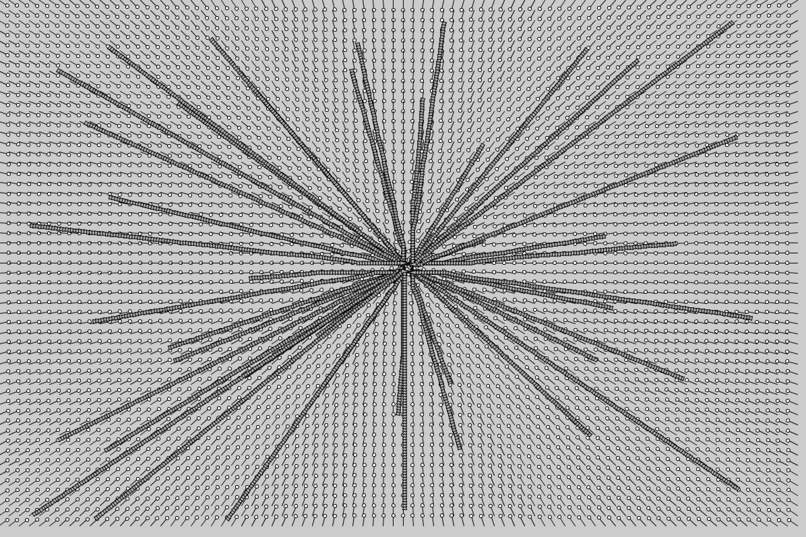
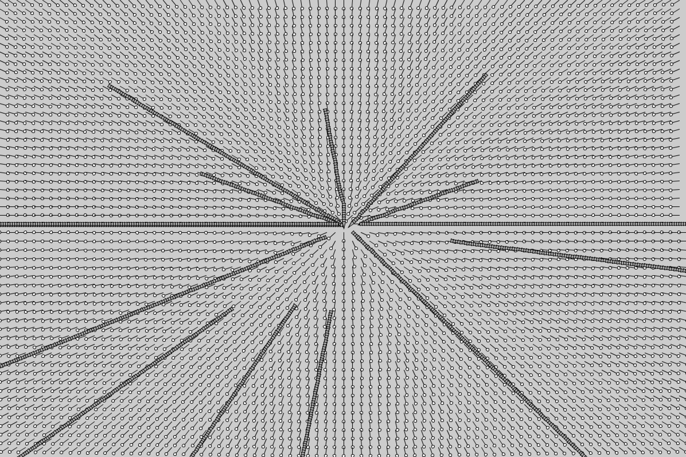

# Flow Field

## Problem 

Top half is pointing to the center, as it should. For some reason (probably a trigonometric one), the bottom half is pointing away from the center.

## Fix

Multiplying the flow field vector by -1 flips its direction, so if a vector has a y greater than the center multiply it by -1.

